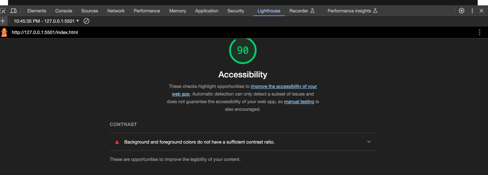

## HTML/CSS Wireframe Exercise

### Lab 08a - Course 201

11.1.23

Today, I practiced building out a professional-style wireframe document from a provided spec using CSS and HTML.

### Author: Stephanie G Johnson

### Links and Resources

[Placeholder Images](https://placehold.co/)

[CSS tricks](https://css-tricks.com/snippets/css/a-guide-to-flexbox/)

[Mozilla on Flexbox](https://developer.mozilla.org/en-US/docs/Learn/CSS/CSS_layout/Flexbox)

### Lighthouse Accessibility Report Score

### Reflections and Comments

How did this go, overall? This took me a really long time. I had to spend a lot of time reading, learning, and troubleshooting. I think the most difficult aspect was making sure the margins met the 30px gutter criteria. I also tried to use semantic attributes for my style sheet and got confused so many times. But I managed. It's much easier to make everything a class and organize it like that. 

What observations or questions do you have about what you’ve learned so far?
Does this get any easier? Lol that's really rhetorical. I know it takes time and practice. But I definitely underestimated how technical this practice is. 

How long did it take you to complete this assignment? And, before you started, how long did you think it would take you to complete this assignment? I thought this assignment would be quick. But it literally took me 6 hours. Those are the breaks. It's kind of embarassing. But I had to read to understand a lot of material. I included those links in this readme. 